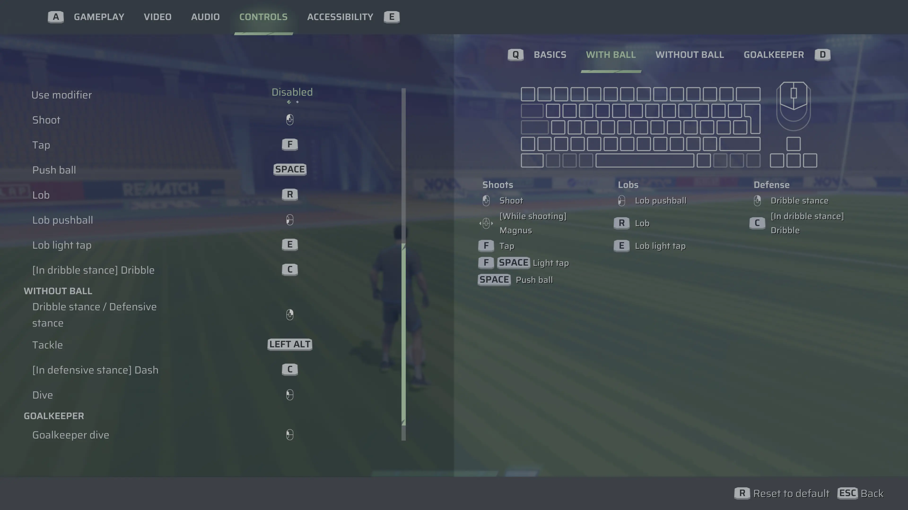

# Rematch Deadzone Fix For KBM

## Who's this for?
Do you play Rematch on PC using keyboard / mouse? Do you get PTSD every time you are about to attempt a pass because of shenanigans like this happening every other game?

<figure>
  
  <figcaption>Credits: u/Toluwar | <a href="https://www.reddit.com/r/Rematch/comments/1lee6b5/my_3rd_goal_also_how_do_i_pass_correctly_on_mouse/">Original Post</a></figcaption>
</figure>

... if so, maybe this can help. Accidents such as the above, is the result of any mouse movement at all impacting the direction of the pass. Since a deadzone has not been implemented yet (as of writing), even the smallest of micro movements of the mouse will result in your lobs going in a seemingly random direction. This fix aims to apply an artificial deadzone using AutohotKey, where only mouse movements beyond a given threshold will register, when any of the pass keys are pressed.


## Prerequisites
- Download this repo *(Download ZIP)*, and extract to a directory you will remember.
- Download & install Autohotkey v2 from https://www.autohotkey.com ***(v1 not supported)***
- Optional *(but recommended)*:
    - [Disable hiding file extensions in Windows](https://www.autodesk.com/support/technical/article/caas/sfdcarticles/sfdcarticles/How-to-enable-hidden-file-extensions-in-Windows.html) - This may not be obvious to some people as an essential must-do on new Windows PCs. If this is you, please do so; otherwise have fun playing russian roulette, opening files like `New Document.exe`.
    - [Visual Studio Code](https://code.visualstudio.com/) w/ [AHK++ extension](https://marketplace.visualstudio.com/items?itemName=mark-wiemer.vscode-autohotkey-plus-plus) - Code editor. Even if you do not code, you may find vscode useful if you frequently find yourself editing files as text. You may have also seen some *Notepad++* recommendations... you can just use this instead (vscode is just a text editor, not an IDE). If you don't care and/or don't want to install another thing just to edit one file, then notepad will suffice.


## Setup
1. Install the Interception Driver *(bundled with repo download)*:
    - Double click on `install-interception-driver.cmd` in the `interception-driver` directory.
    - It should show the admin UAC prompt, with a cmd output window afterwards displaying `Interception successfully installed. You must reboot for it to take effect.` indicating it has installed. Reboot as told.
2. Use `Monitor.ahk` to find your mouse IDs:
    - Launch `Monitor.ahk`.
    - Tick the checkboxes one by one (on the "Mice" side) and test *(e.g. by just clicking)* until you find your current mouse. 
    - When found, click "Copy" on the corresponding VID / PID entry. You may close `Monitor.ahk` after.
    - You probably only need to do this once, unless you are constantly changing mice and/or using different ports.
3. Edit `RematchDeadzone.ahk` w/ any text-editor:
    - Find the line with `mouse_ids := [0x046D, 0xC53A]`. Replace the IDs already there (everything inside square-brackets) with what you copied from the previous step.
    - Configure by editing between the lines `; #region CONFIG` and `; #endregion` accordingly.
    - I am currently using a 1600 DPI mouse w/ 0.5 in-game sensitivity with `mouse_deadzone := 1600`.
    - Here are my in-game settings as an example *(using defaults in `RematchDeadzone.ahk`)*: 


## Usage
- Launch `RematchDeadzone.ahk` ***(not edit)***. If you have installed Autohotkey correctly, it should just open with Autohotkey when double-clicked.
- After launching there should be a green tray icon with an "H", which indicates that it is running. Note that the script only takes effect while the game window is focused and you can see it running in the tray.
- Test in-game by practicing intentional no-look passes (i.e. sliding your mouse beyond the deadzone threshold).
- Right-clicking on the tray icon will give you the option to exit `RematchDeadzone.ahk` *(you should probably exit when not actually playing Rematch)*, and the "Reload Script" option *(allows you to reload any changes you have made to `RematchDeadzone.ahk` while running)*.
- This script also allows you to use shift as dash while in stance for convenience (can't sprint while holding stance anyway). This assumes you have sprint on LShift though. If you do not have sprint as shift and/or do not want this, remove the following code block from `RematchDeadzone.ahk`:
```Autohotkey
#HotIf WinActive('ahk_exe RuntimeClient-WinGDK-Shipping.exe') && GetKeyState(stance_key, 'P')
~*lshift::press(dash_key, 'LShift')
#HotIf
```


## Caveats
- Sometimes a misdirected pass manages to slip through (particularly when trying to do so as the ball is flying towards you). You may try setting the deadzone to 9999, but in my experience it can still happen (like 1/10 times). Not sure why. Still better than playing without though...
- Games with questionable anti-cheats ***(not Rematch's)***, may flag the Interception driver and refuse to start when it is installed. If so, you just have to double-click on `uninstall-interception-driver.cmd` to uninstall and reboot, and decide from here if you want to keep using. The games I have come across ***that actually do this*** so far are ***Halo Infinite*** and ***Battlefield 6 (Open Beta)***. Meanwhile games like Elden Ring, Overwatch, CSGO, and Valorant *(ironically the most invasive anti-cheat known to mankind 😳)* ***do not*** blacklist the Interception driver.


## Licenses & Attributions
This project bundles & uses parts of the following:
- AutoHotInterception: An AutoHotkey wrapper for the Interception driver.
    - Author: evilC
    - License: [MIT License](https://github.com/evilC/AutoHotInterception/blob/master/LICENSE)
    - Source: [https://github.com/evilC/AutoHotInterception](https://github.com/evilC/AutoHotInterception)

- Interception Driver: A low-level driver for intercepting and controlling a range of input devices.
    - Author: oblitum
    - License: [LGPL 3.0](https://github.com/oblitum/Interception/blob/master/licenses/non-commercial-usage/LGPL%203.0.txt)
    - Source: [https://github.com/oblitum/Interception](https://github.com/oblitum/Interception)
